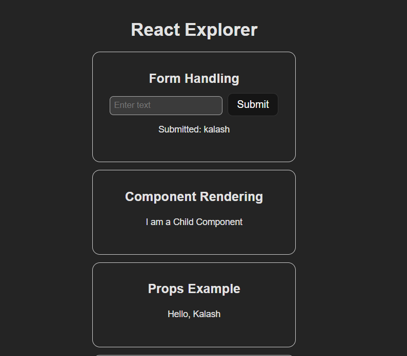
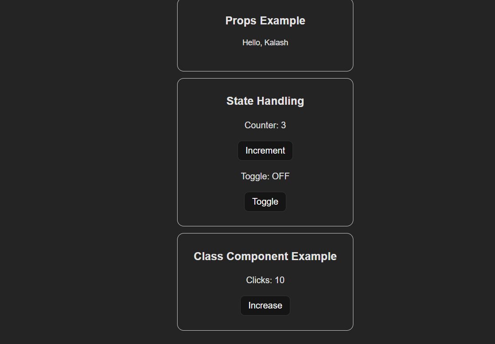

<h2>React Explorer & Counter</h2>

# React Auto Counter

A simple React project that displays a counter which:

- Automatically increments every second
- Allows user to increase or decrease the counter manually
- Uses React functional components with `useState` and `useEffect`

---

## 🚀 Features

- Auto-increments every 1 second
- Increase and Decrease buttons
- Clean UI
- Smooth re-rendering

## 📸 Screenshot

# React Explorer

A simple React project designed to explore and understand core React concepts including **JSX**, **Components**, **Props**, **State**, and **Class Components**.

This project contains modular demo components that help beginners learn React step-by-step.

## 📸 Screenshot

